# PES-VCS Lab Report

**Name:** AMEESHA NARAYANI  
**SRN:** PES2UG24AM194  
**GitHub Repository:** https://github.com/ameesha-n/os-u4-orange-problem.git

## Overview

This project implements a simple version control system called **PES-VCS**. It supports:

- `pes init`
- `pes add <file>...`
- `pes status`
- `pes commit -m "<message>"`
- `pes log`

Implemented files:

- `object.c`
- `tree.c`
- `index.c`
- `commit.c`

---

## Phase 1: Object Storage Foundation

### Screenshot 1A: `./test_objects`

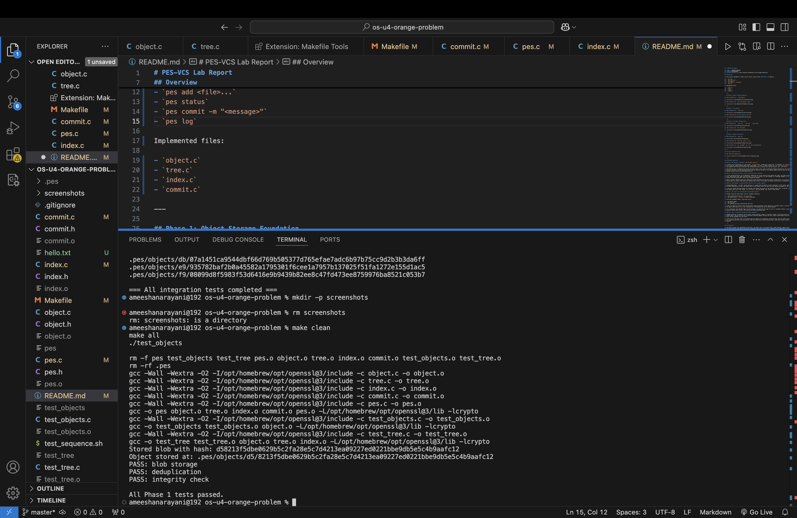

### Screenshot 1B: `find .pes/objects -type f`

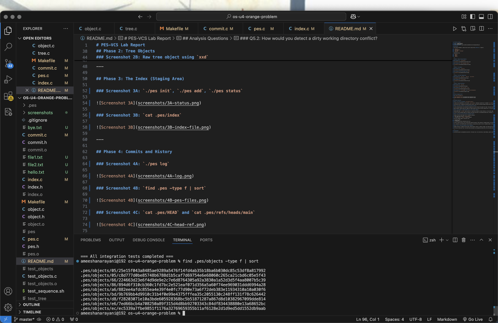

---

## Phase 2: Tree Objects

### Screenshot 2A: `./test_tree`

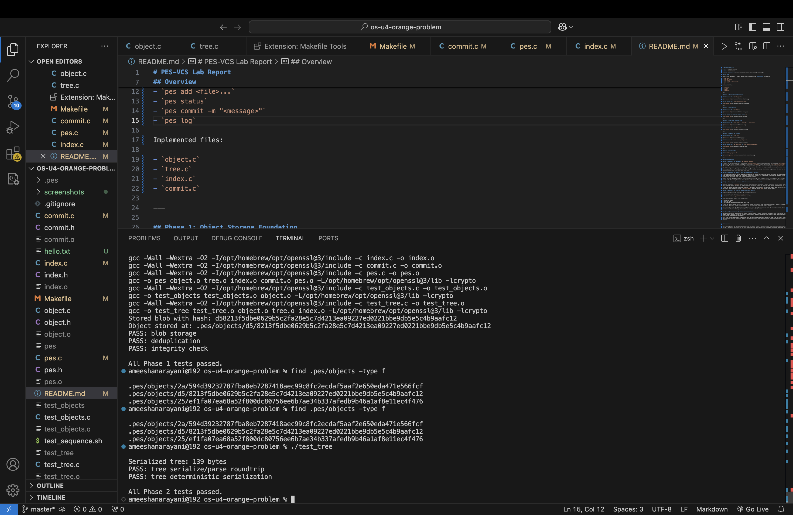

### Screenshot 2B: Raw tree object using `xxd`

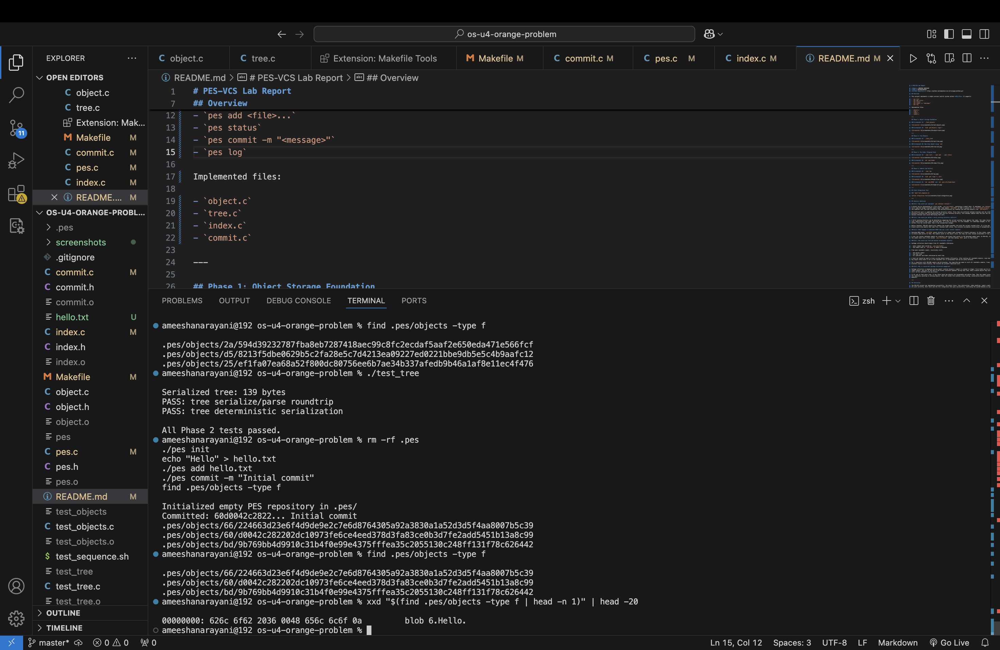

---

## Phase 3: The Index (Staging Area)

### Screenshot 3A: `./pes init`, `./pes add`, `./pes status`

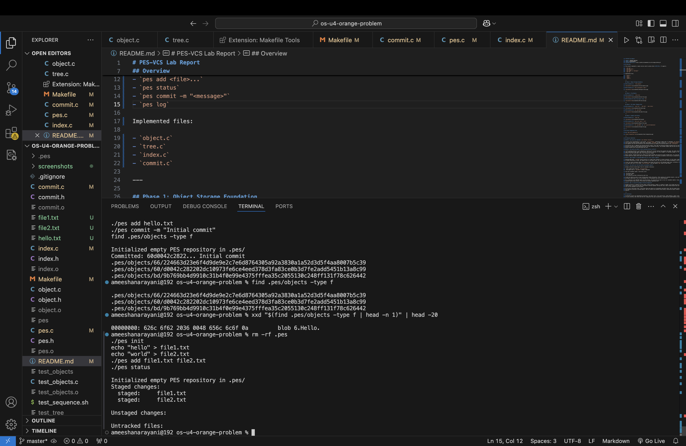

### Screenshot 3B: `cat .pes/index`

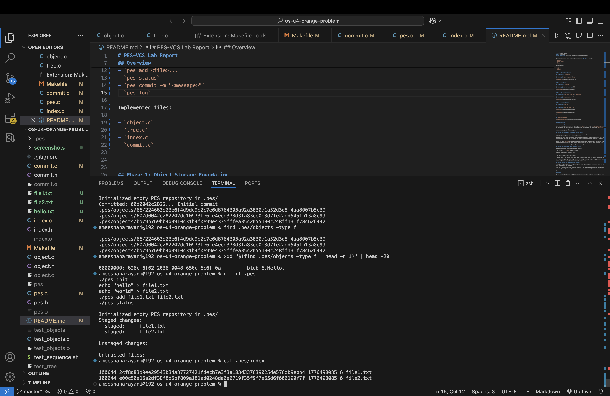

---

## Phase 4: Commits and History

### Screenshot 4A: `./pes log`

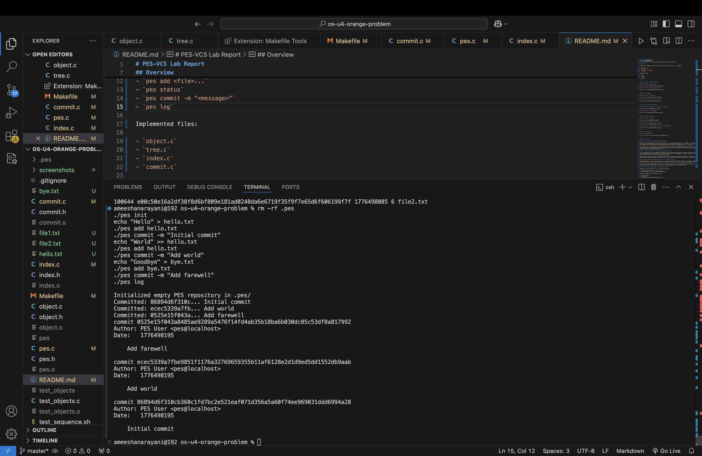

### Screenshot 4B: `find .pes -type f | sort`

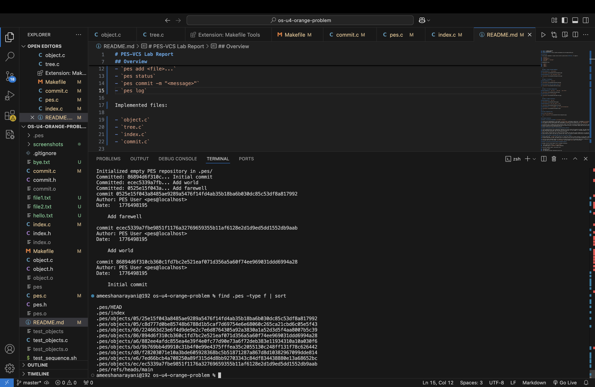

### Screenshot 4C: `cat .pes/HEAD` and `cat .pes/refs/heads/main`

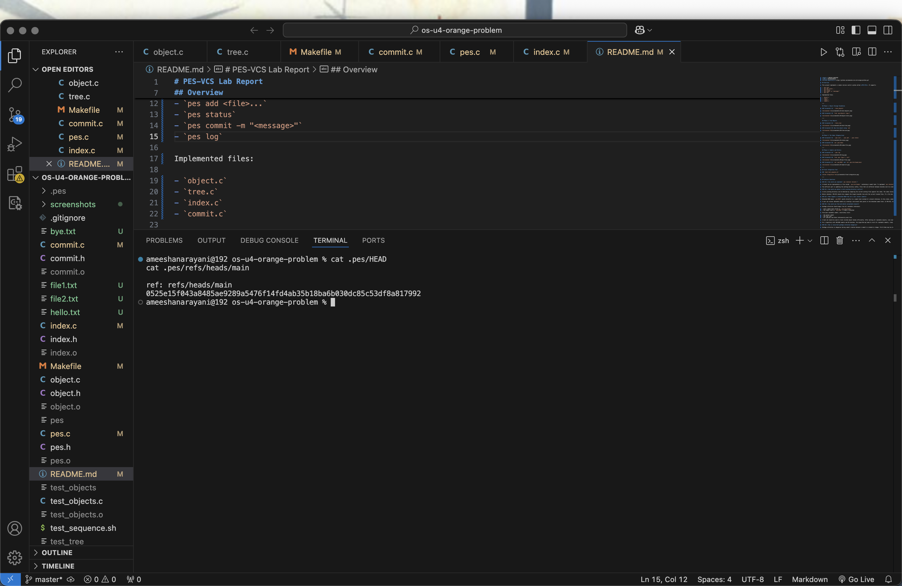

---

## Final Integration Test

### `bash test_sequence.sh`

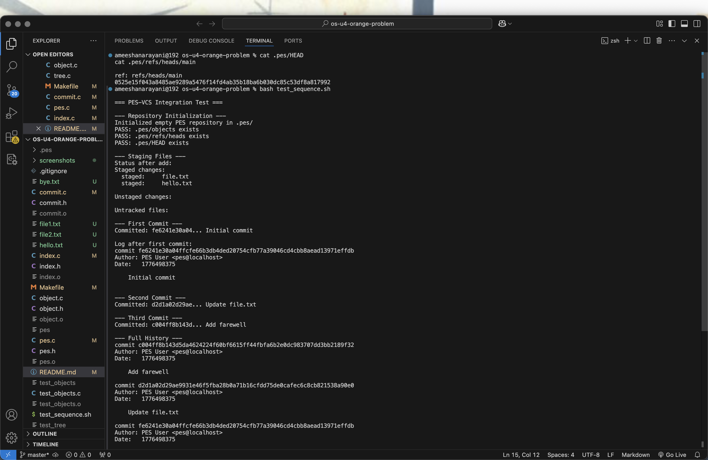
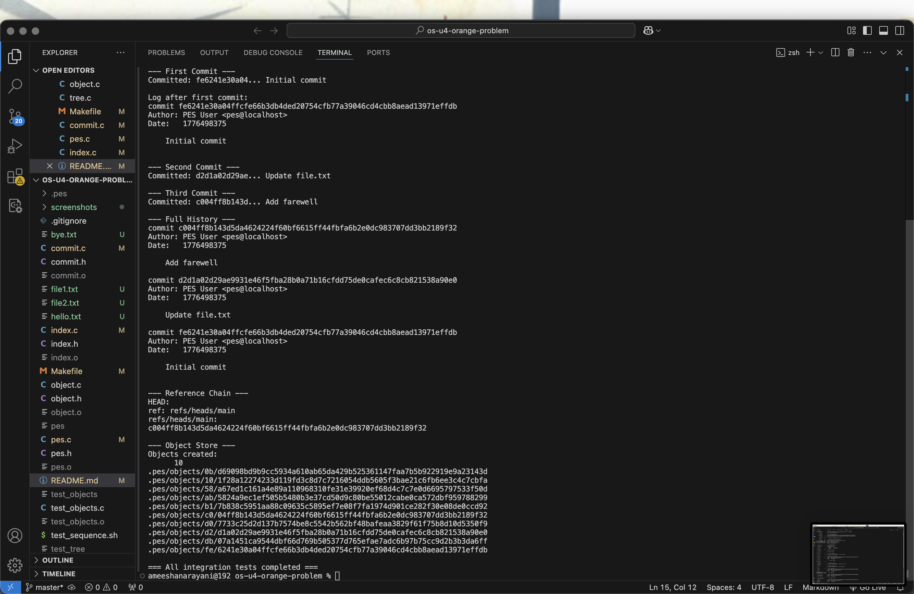

---

## Analysis Questions

### Q5.1: How would you implement `pes checkout <branch>`?

A branch can be represented as a file inside `.pes/refs/heads/` containing a commit hash. To implement `pes checkout <branch>`, PES-VCS would first read the target branch’s commit hash, then update `.pes/HEAD` so that it points to `ref: refs/heads/<branch>`. After that, it would load the commit’s root tree and reconstruct the working directory by reading tree and blob objects from `.pes/objects`.

The difficult part is updating the working directory safely. Files that are different between branches must be created, deleted, or overwritten. Directory structure and file permissions must also be restored correctly. This becomes complex when the user has uncommitted local changes, because checkout must avoid destroying that work.

### Q5.2: How would you detect a dirty working directory conflict?

A dirty working directory can be detected by comparing the current working files against the index. The index stores each tracked file’s path, size, modification time, mode, and blob hash. If a file is missing, its size changed, its timestamp changed, or its recomputed content hash differs from the stored hash, then it has uncommitted changes.

Before checkout, PES-VCS should also compare the target branch’s tree with the current tracked files. If a file has local changes and the target branch would also modify that same file, checkout must refuse. This prevents accidental overwriting of uncommitted work.

### Q5.3: What happens in detached HEAD? How can a user recover commits?

Detached HEAD means `.pes/HEAD` points directly to a commit hash instead of a branch reference. In this state, commits can still be created, but no branch name points to them. The commits exist in the object store, but they can later become unreachable if the user switches away.

A user can recover detached commits by creating a new branch that points to the detached commit hash. In PES-VCS, this could be done by writing the commit hash into a file inside `.pes/refs/heads/` and then making `HEAD` point to that branch.

### Q6.1: How would you find and delete unreachable objects?

Garbage collection should begin from all reachable references:

- every commit hash stored in `.pes/refs/heads/`
- the commit hash in `.pes/HEAD` if HEAD is detached

From each reachable commit, recursively visit:

- the parent commit
- the root tree
- all subtrees and blobs referenced by each tree

A hash set should be used to track visited object hashes efficiently. After marking all reachable objects, scan every file in `.pes/objects`. Any object whose hash is not in the reachable set is unreachable and can be safely deleted.

For a repository with 100,000 commits and 50 branches, the algorithm may need to visit all reachable commits, trees, and blobs. Since many branches usually share history, the visited set prevents duplicate work.

### Q6.2: Why is concurrent garbage collection dangerous?

Garbage collection is dangerous during commit creation because a commit is created in stages. First blobs may be written, then trees, then the commit object, and only at the end is the branch reference updated. During that time, newly created objects may exist in `.pes/objects` but still not be reachable from any branch.

If GC runs at that exact time, it may think those new objects are unreachable and delete them. Then the commit process could finish and leave the repository pointing to missing objects. Real Git avoids this problem using locking, conservative object retention, reflogs, and safer GC behavior.

---

## Conclusion

The PES-VCS project was implemented successfully. The object store, tree construction, index handling, commit creation, and history traversal all work correctly. Unit tests and the full integration test pass successfully, confirming the system behaves as expected.
